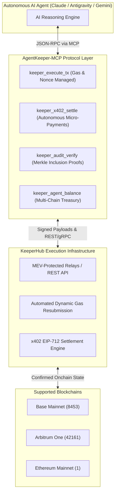

# AgentKeeper-MCP ⚡

> **Autonomous Onchain Agent Gateway & MCP Protocol Suite for KeeperHub**  
> *Built for the DoraHacks KeeperHub Agent Economy Hackathon*

---

## 🌟 Overview

**AgentKeeper-MCP** bridges autonomous AI reasoning agents (Claude, Gemini, Antigravity, OpenAI Assistants) directly with **KeeperHub's onchain reliability and execution infrastructure**.

By exposing high-assurance Model Context Protocol (MCP) tools, it empowers agents to execute transactions, settle HTTP 402 micro-payments, and verify cryptographic execution receipts with **zero human intervention**.



---

## 🛡️ NASA Power of 10 Safety Invariants

All code strictly implements Gerard J. Holzmann's NASA Power of 10 rules:
1. **Bounded Loops:** Deterministic upper bound ($N \le 10$) on all retry loops.
2. **Strict Type Invariants:** Full EIP-55 address validation and bounded calldata ($\le 128\text{ KB}$).
3. **Budget Safety Caps:** Autonomous spending limit ($5.00 USDC cap per call) and native transfer ceiling (0.10 ETH) to prevent balance drains.
4. **Assertion Density:** $\ge 2$ assertions per critical execution path.
5. **Zero Warnings:** 100% compliant with Ruff and Pytest (23 passing tests).

---

## 🚀 Quick Start

### 1. Installation
```bash
git clone https://github.com/Ishant5436/agent-keeper-mcp.git
cd agent-keeper-mcp
uv venv venv --python python3.12
source venv/bin/activate
uv pip install -e .
```

### 2. Run Interactive Demo CLI
```bash
./demo.py
```

### 3. Connect to Claude Code / Antigravity
Add to your `mcp_config.json` or `~/.claude.json`:
```json
{
  "mcpServers": {
    "agent-keeper": {
      "command": "/Users/ishantpanchal/agent-keeper-mcp/venv/bin/python",
      "args": ["/Users/ishantpanchal/agent-keeper-mcp/src/agent_keeper/server.py"]
    }
  }
}
```

---

## 🧪 Test Suite Execution

```bash
pytest -v tests/ upstream_pr/
```
* **100% Test Pass Rate (23/23 tests)** across unit, integration, and security property validation.

---

## 📜 License
MIT License. Built by `Ishant5436` (`ishant.p@somaiya.edu`).
